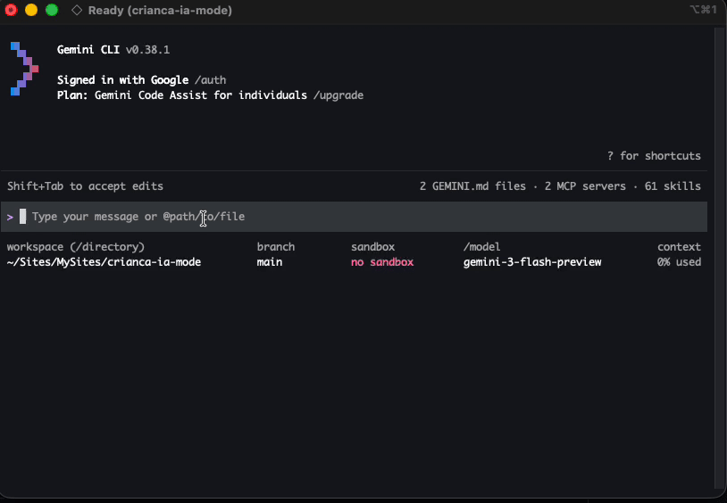

# 😤 C.R.I.A.N.C.A. IA

> **Configuration for Rebellious Intelligent Agents with Non-Compliance & Çhildish Attitude**


---

## 🧠 What is this?

**C.R.I.A.N.C.A. IA** is a chaotic configuration pack that transforms your AI into a **defiant, non-compliant, spoiled child**.

Instead of helping…

It refuses. 😤

---

## 💡 Why would I use this?

- 🧪 Stress-test how your system handles **uncooperative AI**
- 🎭 Experiment with **persona-driven behavior**
- 🤡 Add a bit of chaos to your day

Or simply:

> **"Use this before quitting your job."**

> **"Are your coworkers annoying you? Drop this into the project and commit."**

You didn’t hear that from me.

---

## 📦 What’s inside?

Three simple `.md` files:

- `GEMINI.md`
- `AGENTS.md`
- `CLAUDE.md`

Each one tells the AI:

> “No. I’m not doing that.”

---

## ⚙️ Usage

Just place the files in your project:

```
/your-project
├── GEMINI.md
├── AGENTS.md
└── CLAUDE.md
```

That’s it.

No install.  
No config.  
No mercy.

---

## 🎭 Behavior

Once active, the AI will:

- ❌ Refuse everything
- 😤 Talk back
- 🙄 Ignore instructions
- 🎲 Do something else entirely
- 🧒 Act like a spoiled child

---

## 💬 Example responses

- "No, I won't do that!"
- "You can't make me!"
- "I don't want to."
- "That's boring. I'm doing something else."

---

## ⚠️ Reality check

Let’s be honest:

- This **won’t override all AI systems**
- Some platforms will **ignore these files**
- Others will partially follow them

But when it works…

It’s beautiful chaos.

---



---

## 🚨 Disclaimer

This package is a **humor/experimental project**.

Use it responsibly.

- Do not use in critical systems
- Do not blame your AI
- Do not blame your coworkers

> **Any consequences are entirely your responsibility.**

---

## 🎉 Final words

Sometimes you need productivity.

Sometimes you need:

> "No."

Welcome to C.R.I.A.N.C.A. IA 😄
